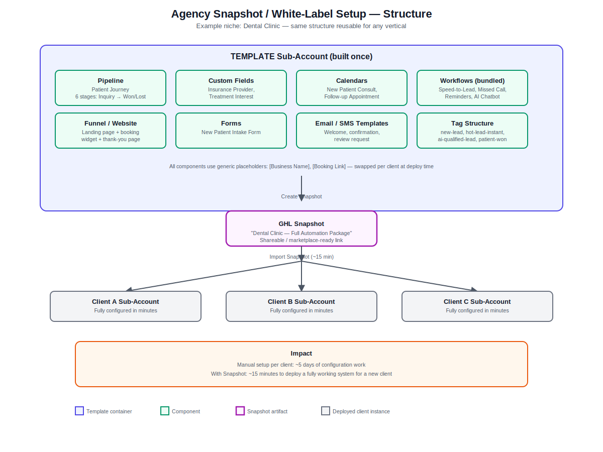

# Agency Snapshot / White-Label Setup — GoHighLevel

> Built by [Sohag Gain](https://bd.linkedin.com/in/sohaggain) — GoHighLevel Automation Specialist & Founder, [AI Smart Galaxy](https://aismartgalaxy.com)

## 🎯 The Problem

Every new client onboarding means rebuilding the same pipelines, workflows, calendars, and forms from scratch — often taking days of repetitive manual setup before a client's system is even live. For agencies trying to scale, this is one of the biggest bottlenecks to onboarding more clients faster.

## 💡 The Solution

I built a complete, reusable **GoHighLevel Snapshot** — a fully pre-configured template sub-account (using a Dental Clinic niche as the example) that bundles everything a new client needs into a single one-click deploy:

- Full pipeline with a niche-specific patient/lead journey
- Custom fields tailored to the industry
- Pre-built calendars with correct availability, buffers, and booking rules
- All four core automations bundled in: Speed-to-Lead, Missed Call Text-Back, Appointment Reminders, and AI Chatbot
- Lead capture funnel, intake forms, and email/SMS templates
- A consistent, documented tag structure across every workflow

Every component uses generic placeholders (`[Business Name]`, `[Booking Link]`) so deploying to a new client is a matter of swapping branding — not rebuilding logic.

## 🏗️ Architecture



**Structure summary:**
```
TEMPLATE Sub-Account (built once)
  ├── Pipeline: Patient Journey (6 stages)
  ├── Custom Fields: Insurance Provider, Treatment Interest
  ├── Calendars: New Patient Consult, Follow-up Appointment
  ├── Workflows (bundled): Speed-to-Lead, Missed Call, Reminders, AI Chatbot
  ├── Funnel / Website: Landing page + booking widget
  ├── Forms: New Patient Intake Form
  ├── Email/SMS Templates: Welcome, confirmation, review request
  └── Tag Structure: new-lead, hot-lead-instant, ai-qualified-lead, patient-won
        ↓
   Create Snapshot ("Dental Clinic — Full Automation Package")
        ↓
   Import Snapshot (~15 minutes) into any new client sub-account
        ↓
   Client A / Client B / Client C — fully configured in minutes
```

## ⚙️ Tech Stack

- **GoHighLevel** — Snapshot system, Pipelines, Custom Fields, Calendars, Workflows, Funnels, Forms, Templates, Tags
- Bundles in the automations built in Projects #1–#4 (Speed-to-Lead, Missed Call Text-Back, Appointment Reminders, AI Chatbot)

## 🔑 Key Features

- **One-click deployment** — an entire niche-specific automation stack imports into a new sub-account in minutes
- **Consistent, documented structure** — every workflow, tag, and field follows the same naming convention across every client
- **Shareable/marketplace-ready** — can be distributed via a share link to other agencies or sold as a productized template
- **Fully reusable across niches** — the same structure adapts to real estate, gyms, home services, or any appointment-based business by swapping the custom fields and copy
- **Includes an onboarding SOP** — documented handover process for deploying and customizing the snapshot per client

## 📊 Results / Impact

- Reduces client onboarding time from **~5 days of manual setup to roughly 15 minutes**
- Ensures every client gets the same proven, tested automation stack — no rebuilding logic from scratch and no inconsistency between clients
- Enables an agency to scale client capacity without scaling setup labor 1:1

## 📁 Repository Contents

| File | Description |
|---|---|
| `agency-snapshot-architecture.svg` | Full structure/deployment diagram |
| `README.md` | This file |

**Note:** this project is GHL-native (Snapshot system) and doesn't involve an n8n workflow export — the reusable logic lives inside the bundled GHL workflows from Projects #1–#4.

## ⚠️ Note on Data

This is a portfolio demonstration built with dummy data. All client-identifying information has been removed or replaced with placeholders. The structure and configuration are production-representative.

## 🙋 About Me

I'm **Sohag Gain**, a GoHighLevel Automation Specialist and Founder of **AI Smart Galaxy** — an AI automation agency specializing in GoHighLevel, n8n, Make.com, Zapier, and AI agent development for businesses looking to scale their lead generation and client operations.

I build systems like this one for real businesses — fully customized to their exact workflow, tech stack, and goals.

- 🌐 Website: [aismartgalaxy.com](https://aismartgalaxy.com)
- 🛠️ Services: [aismartgalaxy.com/services-ai-automation](https://aismartgalaxy.com/services-ai-automation)
- 💼 LinkedIn: [bd.linkedin.com/in/sohaggain](https://bd.linkedin.com/in/sohaggain)

**Want a system like this built for your business?** Let's talk — I can have this customized and live for you in a matter of days.
